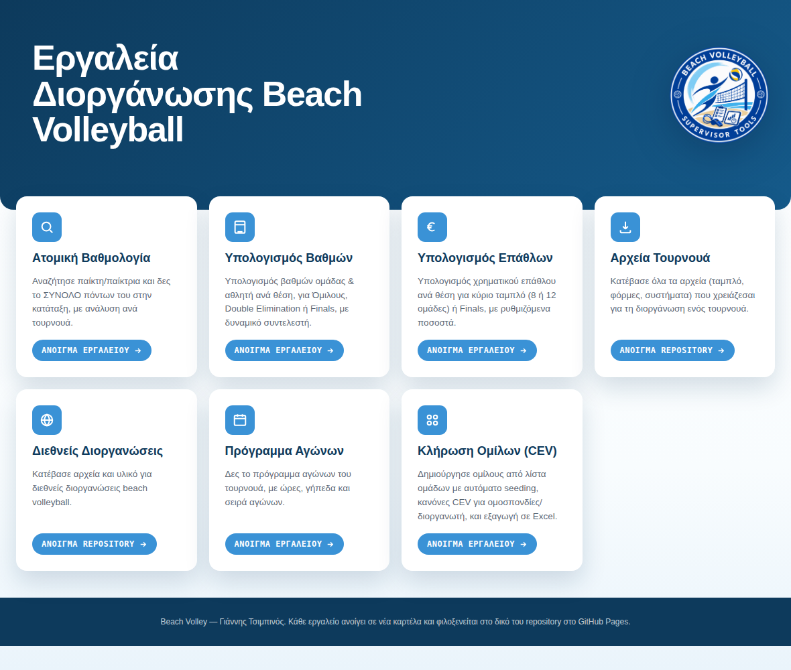
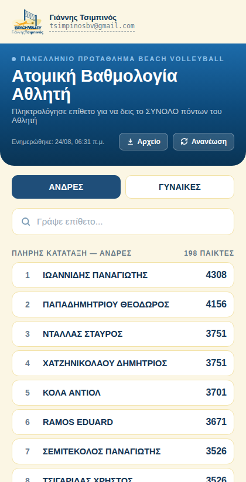

# 🏐 Εργαλεία Διοργάνωσης Beach Volleyball

Μια συλλογή από πρακτικά εργαλεία για τη διοργάνωση τουρνουά beach volleyball — βαθμολογία, υπολογισμός βαθμών και επάθλων, πρόγραμμα αγώνων, κλήρωση ομίλων και αρχεία τουρνουά — μαζεμένα σε μία ενιαία εφαρμογή που **εγκαθίσταται σαν κανονική εφαρμογή σε Android, iPhone ή υπολογιστή** και δουλεύει ακόμα και χωρίς σύνδεση στο internet.



## Τι είναι αυτό

Το project ξεκίνησε ως μια σειρά από ανεξάρτητες σελίδες για κάθε εργαλείο διοργάνωσης και εξελίχθηκε σε μια πλήρη **Progressive Web App (PWA)**: μία αρχική σελίδα-κόμβος συνδέει επτά εργαλεία, όλα φτιαγμένα σε καθαρή HTML/CSS/JavaScript, χωρίς εξαρτήσεις από κάποιο framework, χωρίς backend server και χωρίς κόστος φιλοξενίας — τρέχει εξ ολοκλήρου στον browser και φιλοξενείται δωρεάν σε GitHub Pages.

Ο στόχος είναι ένα supervisor/διοργανωτής να έχει όλα τα εργαλεία που χρειάζεται στο κινητό του, μέσα σε ένα εικονίδιο στην αρχική οθόνη, ακόμα και σε γήπεδο χωρίς σταθερή σύνδεση.

## 📱 Λειτουργεί σαν εφαρμογή (PWA)

- **Εγκατάσταση σε Android**: άνοιξε το site σε Chrome → «Εγκατάσταση εφαρμογής» → εμφανίζεται εικονίδιο στην αρχική οθόνη, ανοίγει σε πλήρη οθόνη σαν κανονική εφαρμογή.
- **Λειτουργεί offline**: ένα service worker αποθηκεύει τοπικά τις σελίδες και τα δεδομένα, ώστε η εφαρμογή να ανοίγει ακόμα κι όταν δεν υπάρχει internet (π.χ. μέσα σε γήπεδο).
- **Ενημερώνεται αυτόματα**: κάθε φορά που η εφαρμογή σερβίρεται online, ελέγχει και φορτώνει αθόρυβα τυχόν νεότερη έκδοση.
- Πλήρεις οδηγίες δημοσίευσης σε GitHub Pages και εγκατάστασης σε κινητό υπάρχουν στο [`ΟΔΗΓΙΕΣ-ΕΓΚΑΤΑΣΤΑΣΗΣ.md`](ΟΔΗΓΙΕΣ-ΕΓΚΑΤΑΣΤΑΣΗΣ.md).

## 🧰 Τα εργαλεία

| Εργαλείο | Αρχείο | Τι κάνει |
|---|---|---|
| 🔍 Ατομική Βαθμολογία | `Ranking.html` | Αναζήτηση παίκτη/παίκτριας και προβολή του ΣΥΝΟΛΟΥ πόντων του στην κατάταξη, με ανάλυση ανά τουρνουά. |
| 📋 Υπολογισμός Βαθμών | `PointSystem.html` | Υπολογισμός βαθμών ομάδας & αθλητή ανά τελική θέση, για Ομίλους, Double Elimination ή Finals, με ρυθμιζόμενο συντελεστή τουρνουά. |
| € Υπολογισμός Επάθλων | `Prices.html` | Υπολογισμός χρηματικού επάθλου ανά θέση, για κύριο ταμπλό (8 ή 12 ομάδες) ή Finals, με ρυθμιζόμενα ποσοστά κατανομής. |
| 📅 Πρόγραμμα Αγώνων | `Schedules.html` | Πρόγραμμα αγώνων του τουρνουά: ώρες, γήπεδα και σειρά αγώνων. |
| ⬇️ Αρχεία Τουρνουά | `files/index.html` | Λίστα αρχείων (ταμπλό, φόρμες, συστήματα) για τη διοργάνωση — φορτώνεται **αυτόματα** από τον φάκελο `files/` του repository. |
| 🌐 Διεθνείς Διοργανώσεις | `International/index.html` | Ίδιος μηχανισμός με τα «Αρχεία Τουρνουά», για υλικό διεθνών διοργανώσεων — συνδεδεμένο με τον φάκελο `International/`. |
| ⚬⚬ Κλήρωση Ομίλων (CEV) | `PoolDraw.html` | Δημιουργεί ομίλους από λίστα ομάδων με αυτόματο snake-seeding βάσει βαθμών, τηρώντας τους κανόνες CEV για ομοσπονδίες/διοργανωτή, με εισαγωγή λίστας ομάδων από αρχείο και εξαγωγή αποτελέσματος σε Excel. |

Κάθε εργαλείο ανοίγεται από μία κάρτα στην αρχική σελίδα (`index.html`) και έχει το δικό του λογότυπο, email επικοινωνίας και σύνδεσμο επιστροφής στην αρχική.

### Ξεχωριστές λεπτομέρειες

- **Ατομική Βαθμολογία**: τα δεδομένα διαβάζονται από το `Ranking.xlsx` στον ίδιο φάκελο. Αν δεν υπάρχει σύνδεση, χρησιμοποιείται το τελευταίο αντίγραφο που είχε αποθηκευτεί τοπικά. Υπάρχει επίσης κουμπί **«Αρχείο»** για να ανεβάσεις χειροκίνητα ένα ενημερωμένο `Ranking.xlsx` απευθείας από το κινητό σου — αυτό γίνεται η ενεργή πηγή δεδομένων σε κάθε άνοιγμα της εφαρμογής, μέχρι να πατήσεις «Ανανέωση» ή να ανεβάσεις άλλο αρχείο.
- **Αρχεία Τουρνουά / Διεθνείς Διοργανώσεις**: δεν χρειάζονται καμία συντήρηση HTML. Ανεβάζεις ένα αρχείο μέσα στον αντίστοιχο φάκελο στο GitHub και εμφανίζεται αυτόματα στη λίστα (μέσω του δημόσιου GitHub API) — με όνομα, μέγεθος και σύνδεσμο λήψης.
- **Κλήρωση Ομίλων**: ακολουθεί τους κανονισμούς CEV (Άρθρο 13.5) — μέγιστο 2 ομάδες ανά ομοσπονδία στον ίδιο όμιλο και οι ομάδες του διοργανωτή σε διαφορετικούς ομίλους, με αυτόματη επίλυση συγκρούσεων.

## ⚙️ Τεχνολογία

- **Καθαρή HTML / CSS / JavaScript** — καμία εξάρτηση από framework, καμία διαδικασία build.
- **Web App Manifest** (`manifest.json`) + **Service Worker** (`service-worker.js`) για εγκατάσταση και λειτουργία offline.
- **[SheetJS](https://sheetjs.com/)** για ανάγνωση/εγγραφή αρχείων Excel (.xlsx) απευθείας στον browser.
- **GitHub REST API** (`contents/{folder}`) για την αυτόματη λίστα αρχείων στα «Αρχεία Τουρνουά» και «Διεθνείς Διοργανώσεις».
- **GitHub Pages** για δωρεάν φιλοξενία — δεν χρειάζεται server.

## 📂 Δομή του Project

```
.
├── index.html                    # Αρχική σελίδα — κόμβος με τα 7 εργαλεία
├── Ranking.html                  # Ατομική Βαθμολογία
├── Ranking.xlsx                  # Δεδομένα βαθμολογίας
├── PointSystem.html              # Υπολογισμός Βαθμών
├── Prices.html                   # Υπολογισμός Επάθλων
├── Schedules.html                # Πρόγραμμα Αγώνων
├── PoolDraw.html                 # Κλήρωση Ομίλων (CEV)
├── files/
│   └── index.html                # Αρχεία Τουρνουά (αυτόματη λίστα)
├── International/
│   └── index.html                # Διεθνείς Διοργανώσεις (αυτόματη λίστα)
├── icons/                        # Εικονίδια εφαρμογής (PWA)
├── manifest.json                 # Στοιχεία ταυτότητας της εφαρμογής
├── service-worker.js             # Offline λειτουργία & caching
├── offline.html                  # Σελίδα όταν δεν υπάρχει σύνδεση
└── ΟΔΗΓΙΕΣ-ΕΓΚΑΤΑΣΤΑΣΗΣ.md         # Αναλυτικές οδηγίες δημοσίευσης/εγκατάστασης
```

## 🚀 Δημοσίευση & εγκατάσταση

Σύντομη εκδοχή:

1. Ανέβασε όλα τα αρχεία αυτού του repository σε ένα public GitHub repository.
2. Ενεργοποίησε το **GitHub Pages** (Settings → Pages → Deploy from branch → `main` / root).
3. Άνοιξε το link που δίνει το GitHub Pages σε Chrome στο κινητό σου και επίλεξε **«Εγκατάσταση εφαρμογής»**.

Αναλυτικά βήματα, screenshots και συχνές απορίες (π.χ. πώς ενημερώνεις το `Ranking.xlsx`, πώς προσθέτεις αρχεία στα «Αρχεία Τουρνουά») υπάρχουν στο [`ΟΔΗΓΙΕΣ-ΕΓΚΑΤΑΣΤΑΣΗΣ.md`](ΟΔΗΓΙΕΣ-ΕΓΚΑΤΑΣΤΑΣΗΣ.md).

## 🔄 Ενημέρωση δεδομένων

| Τι θέλεις να αλλάξεις | Πώς |
|---|---|
| Βαθμολογία (`Ranking.xlsx`) | Ανέβασέ το ξανά στο repository με το ίδιο όνομα, **ή** χρησιμοποίησε το κουμπί «Αρχείο» μέσα στην εφαρμογή για στιγμιαία ενημέρωση από το κινητό σου. |
| Αρχεία τουρνουά / διεθνών διοργανώσεων | Ανέβασέ τα στον φάκελο `files/` ή `International/` — εμφανίζονται αυτόματα, καμία επεξεργασία HTML. |
| Ίδια η εφαρμογή (νέο εργαλείο, αλλαγή σχεδίασης) | Αντικατάστησε τα σχετικά αρχεία στο repository· οι ήδη εγκατεστημένες συσκευές παίρνουν την ενημέρωση αυτόματα στο επόμενο online άνοιγμα. |

## 📸 Στιγμιότυπο εργαλείου



## ✉️ Επικοινωνία

**Γιάννης Τσιμπινός**
📧 [tsimpinosbv@gmail.com](mailto:tsimpinosbv@gmail.com)

---

© Γιάννης Τσιμπινός. Beach Volleyball Supervisor Tools.
